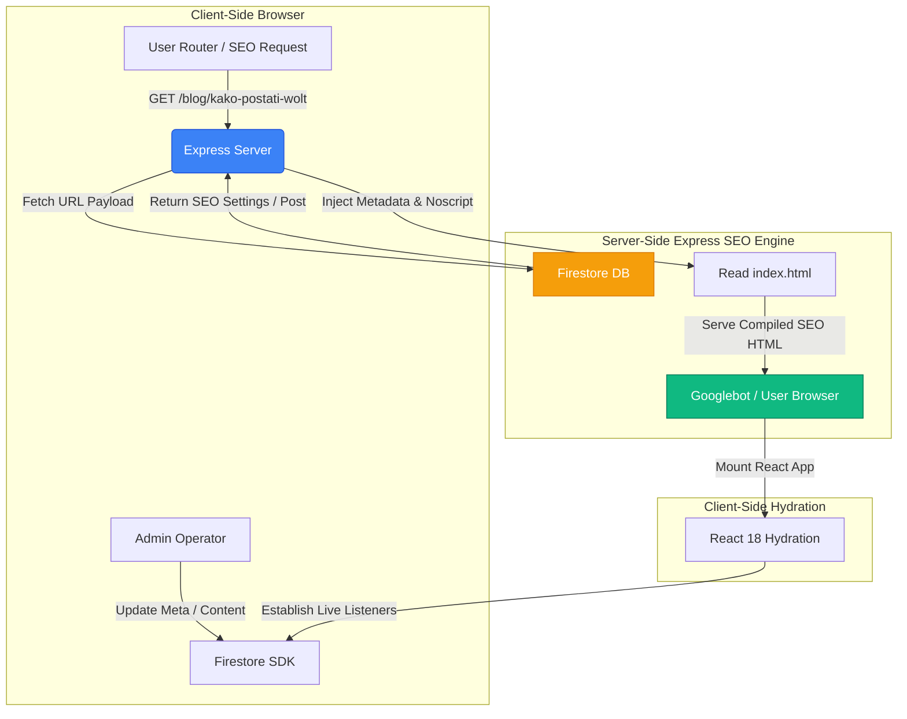

# System Architecture: Deliverix

This document provides a highly comprehensive technical breakdown of the **Deliverix** platform.

---

## 1. Directory Structure & Key Files

Deliverix is built as a highly structured, scalable full-stack Node.js application:

- `/server.ts` - Main Express server entry point. Serves API endpoints, generates the dynamic `/sitemap.xml`, and operates the Server-Side SEO Pre-Rendering Engine.
- `/src/main.tsx` - Vite entry point for the React application.
- `/src/App.tsx` - Main client-side router, state synchronizer, and visual shell.
- `/src/components/` - Extracted sub-components:
  - `AdminDashboard.tsx` - Complete administrative interface.
  - `AdminSeoSubtabs.tsx` - Content, blog, FAQ, and SEO configuration panels.
  - `LandingPage.tsx` - Main visitor-facing landing page.
  - `CandidatePortal.tsx` - Interactive panel for applicants.
- `/src/types.ts` - Centralized TypeScript interface, enums, and types definitions.
- `/index.html` - Raw HTML template with dynamic placeholder comments for Express pre-rendering injection.

---

## 2. High-Level Data Flow Diagram

The following diagram represents how data moves through Deliverix, showing how the Server-Side SEO Engine and React Client communicate with Firestore:



---

## 3. Server-Side Architecture (Express)

The backend layer is written in TypeScript and compiled into a standalone CommonJS bundle (`dist/server.cjs`) for runtime performance.

### 3.1 Routing & API Endpoints
The backend handles standard static assets and provides secure administrative routing proxying Firebase:
- `/api/marketing/seo` - Dynamic CRUD of SEO metadata and settings.
- `/api/blog-posts` - Database querying and management for blog content.
- `/api/candidates` - Core recruitment registry with status modifiers.
- `/sitemap.xml` - Dynamic, real-time sitemap generator.

### 3.2 Dynamic Server-Side SEO Pre-Rendering
When an HTML request arrives:
1. Express intercepts the path (e.g., `/blog/kako-postati-wolt-dostavljac-2026`).
2. If the user-agent matches a crawler or if the request is standard HTML, the server reads `index.html` into memory.
3. It queries the `blog_posts` collection in Firestore using the slug parameter.
4. If found, it dynamically injects:
   - `<title>${post.title} | Deliverix</title>`
   - `<meta name="description" content="${post.excerpt}">`
   - `<link rel="canonical" href="https://deliverix.rs/blog/${post.slug}">`
   - Linked Data JSON-LD (`Article` structure).
   - A `<noscript>` payload rendering the complete body text and headers so search engines index the full content without executing JavaScript.
5. If the request is for a generic landing page or homepage, it queries `site_configs/homepage_settings` and performs similar metadata modifications.

---

## 4. Client-Side Architecture (React)

The frontend is implemented using React 18, utilizing functional components, custom hooks, and context state.

### 4.1 State Management & Live Hydration
Client-side data synchronization utilizes real-time Firestore snapshots (`onSnapshot`). This ensures:
- Whenever an administrator modifies the homepage layout, FAQs, or SEO values in the dashboard, the changes are pushed to connected browsers instantly.
- Live Candidate CRM status updates propagate to screens instantly without reloading.

### 4.2 Component Modularization
- **`App.tsx`**: Manages path parsing, visual headers, footers, and page loading states.
- **`LandingPage.tsx`**: Optimized for high speed and mobile conversions. Utilizes dynamic layouts powered by the Admin CMS.
- **`AdminDashboard.tsx`**: Renders tables, pipeline pipelines, partner lists, and email control forms. It is isolated from the public views to avoid unnecessary asset loading.

---

## 5. ESM / CommonJS Build & Execution

The Node application must be compiled cleanly for production deployment:

- **Development Mode**: Handled via `tsx server.ts` for rapid TypeScript reloading.
- **Compilation Phase**:
  ```bash
  vite build && esbuild server.ts --bundle --platform=node --format=cjs --packages=external --sourcemap --outfile=dist/server.cjs
  ```
- **Execution Phase**:
  ```bash
  node dist/server.cjs
  ```

This esbuild bundling converts the Server-Side TypeScript into a highly optimized, single-file CommonJS module, bypassing Node's strict runtime ESM path checks, while excluding raw npm packages (`--packages=external`).
